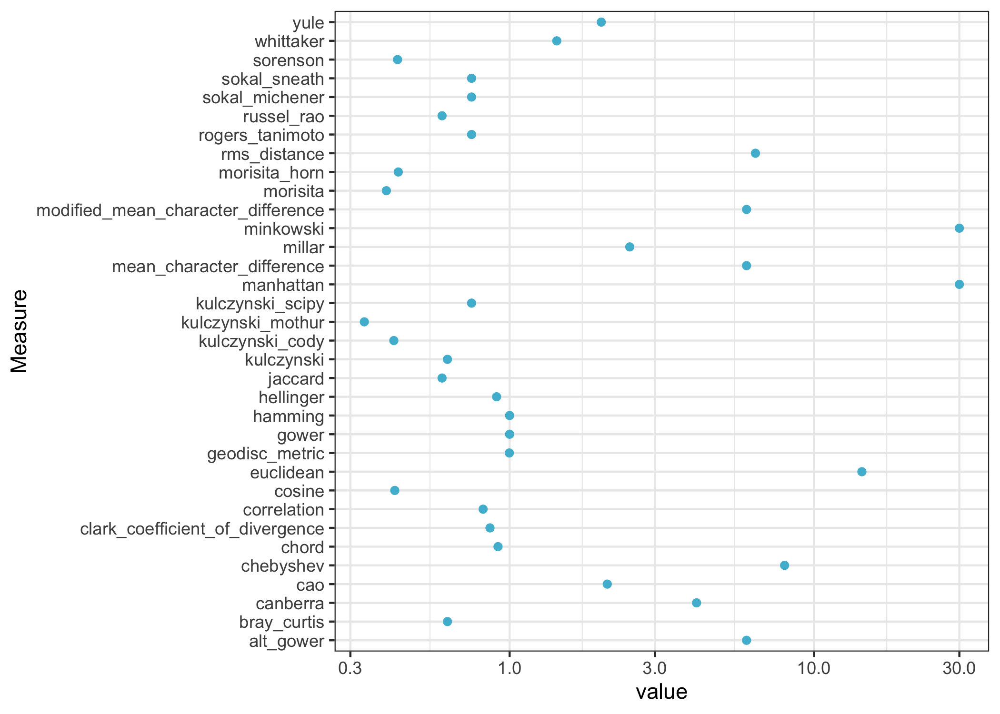

<!-- README.md is generated from README.Rmd. Please edit that file -->

# ecofuncs

This package re-implements measures of ecological diversity from several
other software packages, including `vegan`, `scikit-bio`, and
`GUniFrac`.

## Installation

You can install ecofuncs from github with:

``` r
# install.packages("devtools")
devtools::install_github("kylebittinger/ecofuncs")
```

## Example

Let’s say we’ve surveyed a field and counted the number of plants in
each of two sites. We’ve found five species in total, and we’d like to
summarize the diversity of the two sampling sites. Here are the results
for site 1 and site 2, represented as vectors.

``` r
s1 <- c(2, 5, 16, 0, 1)
s2 <- c(0, 0, 8, 8, 8)
```

The two sites have about the same number of total plants, but the
ditsribution of species is much different. More than half the plants in
site 1 belong to a single species, whereas the plants in site 2 are
almost evenly distributed across three different species. To get
started, let’s look at a few measures of diversity for each sample.

Richness measures the total number of species in each sample.

``` r
richness(s1)
#> [1] 4
richness(s2)
#> [1] 3
```

The Shannon index measures both the number of species and the evenness
of the relative abundance values. Site 2 has fewer species, but each
species has the same relative abundance, so the Shannon index is higher.

``` r
shannon(s1)
#> [1] 0.9365995
shannon(s2)
#> [1] 1.098612
```

Let’s summarize the diversity of site 1 and site 2 using all the
functions available in this library. The full set of within-sample
diversity functions is available as a character vector in
`alpha_diversities`. The term “α-diversity” means the diversity within a
single sample.

``` r
library(tidyverse)
tibble(Measure = alpha_diversities) %>%
  group_by(Measure) %>%
  summarize(Site1 = get(Measure)(s1), Site2 = get(Measure)(s2)) %>%
  pivot_longer(-Measure, "SampleID") %>%
  ggplot(aes(x=Measure, y=value, color=SampleID)) +
  geom_point() +
  scale_color_manual(values=c("#E64B35", "#4DBBD5")) +
  coord_flip() +
  theme_bw()
```

<!-- -->

We can see that site 1 is regarded as more diverse by some measures; it
has the most species. For other measures, site 2 is regarded as more
diverse; it has the most even distribution of species.

In our documentation, you can find more info on each α-diversity
function.

Having assessed the within-sample diversity, we can next ask about the
number of shared species between sites. If species are shared, how
similar is the distribution across species? There are many ways to
quantify this between-sample diversity or β-diversity.

We can view β-diversity as either the similarity or dissimilarity
between sites. The functions in `ecofuncs` are written in terms of
dissimilarity: similar sites will have values close to zero, and highly
dissimilar sites will have values close to the maximum.

The Jaccard distance counts the fraction of species present in only one
site. The answer is 3 out of 5, or 0.6.

``` r
jaccard(s1, s2)
#> [1] 0.6
```

The Bray-Curtis dissimilarity adds up the absolute differences between
species counts, then divides by the total counts. For our two sites,
that’s (2 + 5 + 8 + 8 + 7) / 48, or 0.625.

``` r
bray_curtis(s1, s2)
#> [1] 0.625
```

Again, we’ll use a vector called `beta_diversities` to compute every
dissimilarity measure in the library.

``` r
tibble(Measure = beta_diversities) %>%
  group_by(Measure) %>%
  mutate(value = get(Measure)(s1, s2)) %>%
  ggplot(aes(x=Measure, y=value)) +
  geom_point(color="#4DBBD5") +
  scale_y_log10() +
  coord_flip() +
  theme_bw()
```

<!-- -->

The dissimilarities are generally positive, and they have a range of
scales. Some dissimilarity measures range from 0 to 1, while others can
go up indefinitely.

As before, you can find more info on each β-diversity function in our
documentation.
